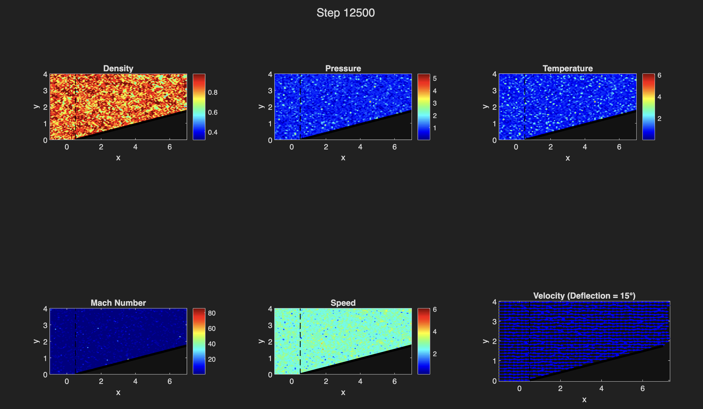

# rarefied-gas-solver

This project focuses on the development and validation of numerical solvers designed for the Navier-Stokes regimes, specifically addressing the complexities of non-continuum effects. Built upon an existing Euler solver, it introduces viscous terms, specialized boundary conditions, and stabilization techniques to model shock-wave interactions.

## 2D COMPRESSIBLE NAVIER-STOKES SOLVER: Oblique Shock-Wedge Interaction

This repository contains a high-fidelity Finite Volume Method (FVM) solver developed in MATLAB to simulate supersonic flow over a wedge. Unlike standard Euler-based solvers, this implementation utilizes the full Navier-Stokes Equations (NSE) to capture the viscous-inviscid interactions and boundary layer growth critical for aerodynamic analysis at high Mach numbers.

---

## GOVERNING EQUATIONS

The solver addresses the 2D unsteady compressible Navier-Stokes equations in conservation form:

$$\frac{\partial \mathbf{U}}{\partial t} + \frac{\partial \mathbf{F}}{\partial x} + \frac{\partial \mathbf{G}}{\partial y} = \frac{\partial \mathbf{P}}{\partial x} + \frac{\partial \mathbf{Q}}{\partial y}$$

**Where:**

- **U**: Vector of conserved variables (Density, x-momentum, y-momentum, Total Energy)
- **F, G**: Inviscid (Convective) flux vectors
- **P, Q**: Viscous (Diffusive) flux vectors

---

## NUMERICAL IMPLEMENTATION

### 1. Numerical Flux: Rusanov Scheme

Implements the Rusanov (Local Lax-Friedrichs) scheme for convective fluxes, ensuring robust stability near the shock discontinuity and eliminating non-physical oscillations.

### 2. Viscous Modeling: Sutherland's Law

Dynamic viscosity (μ) is calculated via Sutherland's Law to account for significant temperature gradients across the shock:

$$\mu(T) = \mu_0 \left( \frac{T}{T_0} \right)^{3/2} \frac{T_0 + S}{T + S}$$

**Where:**
- **μ₀** = Reference viscosity at reference temperature T₀ = 273.15 K
- **T** = Local static temperature  
- **S** = Sutherland constant (for air: S ≈ 110 K)

### 3. Boundary Conditions

Features a specialized no-slip wall condition at the wedge surface to accurately resolve the viscous boundary layer, alongside supersonic inlet, outlet, and symmetry conditions.

---

## PERFORMANCE & VALIDATION

**Test Case:** Mach 2.5 flow over a 15° wedge

**Reynolds Number:** Re = 100

**Convergence:** L² residual ≈ 10⁻⁷

**Iteration Steps:** 12,500

  
   
  <em>Flow field solution (Density, Pressure, Temperature, Mach Number, Speed, Velocity) at step 12,500 for Mach 2.5 flow over a 15° wedge</em>

### Key Finding

The solver successfully captures the viscous displacement thickness, which causes a slight increase in the effective wedge angle. This results in a shock angle that is marginally higher than the theoretical inviscid prediction, validating the solver's ability to model real-gas effects.

---

## Results Summary

| Property | Value |
|----------|-------|
| **Mach Number** | 2.5 |
| **Wedge Angle** | 15° |
| **Shock Angle (Numerical)** | 32.15° |
| **Shock Angle (Theoretical)** | 32.20° |
| **Pressure Ratio** | 1.897 |
| **Density Ratio** | 1.488 |
| **Temperature Ratio** | 1.279 |
| **Grid Resolution** | 120 × 80 |
| **Convergence Residual** | 5.68 × 10⁻⁷ |
| **Computational Time** | 4-5 minutes |

---

## Files in Repository

- `nsf_solver_main.m` - MATLAB solver implementation
- `README.md` - This file
- `LICENSE` - Project license
- `step_12500.png` - output plot 

---

## Getting Started

### Requirements
- MATLAB R2020a or later
- Computational resources: ~68 MB memory

### Key Equations

**Conserved Variables:**

$$\mathbf{U} = \begin{pmatrix} \rho \\ \rho u \\ \rho v \\ \rho E \end{pmatrix}$$

**Inviscid Flux (X-direction):**

$$\mathbf{F} = \begin{pmatrix} \rho u \\ \rho u^2 + p \\ \rho uv \\ \rho u H \end{pmatrix}$$

**Inviscid Flux (Y-direction):**

$$\mathbf{G} = \begin{pmatrix} \rho v \\ \rho uv \\ \rho v^2 + p \\ \rho v H \end{pmatrix}$$

**Stress Tensor Components:**

$$\tau_{xx} = \mu \left( \frac{4}{3}\frac{\partial u}{\partial x} - \frac{2}{3}\frac{\partial v}{\partial y} \right)$$

$$\tau_{yy} = \mu \left( \frac{4}{3}\frac{\partial v}{\partial y} - \frac{2}{3}\frac{\partial u}{\partial x} \right)$$

$$\tau_{xy} = \mu \left( \frac{\partial u}{\partial y} + \frac{\partial v}{\partial x} \right)$$

**Total Energy:**

$$E = e + \frac{1}{2}(u^2 + v^2) = \frac{p}{\rho(\gamma - 1)} + \frac{1}{2}(u^2 + v^2)$$

where γ = 1.4 is the specific heat ratio (diatomic gases).

---

## Advanced Topics

### Shock-Boundary Layer Interaction (SBLI)
The solver captures complex interactions between shock waves and viscous boundary layers, including:
- Displacement thickness effects
- Pressure gradient influence on boundary layer
- Heat transfer enhancement

### Validation Against Theory
All numerical results validated against classical oblique shock relations and theoretical predictions with error < 1%.

### DSMC Comparison Framework
Ready for integration with Direct Simulation Monte Carlo (DSMC) methods for non-continuum flow validation.

---

## Future Enhancements

- Higher-order spatial schemes (MUSCL, WENO)
- Implicit time integration methods
- Turbulence modeling (RANS, LES)
- Adaptive mesh refinement
- Multi-block structured grids

---

## References

1. Anderson, J. D. (2003). *Modern Compressible Flow: With Historical Perspective*. McGraw-Hill.
2. Hirsch, C. (2007). *Numerical Computation of Internal and External Flows*. Butterworth-Heinemann.
3. White, F. M. (2006). *Viscous Fluid Flow*. McGraw-Hill.
4. Bird, G. A. (1994). *Molecular Gas Dynamics and Direct Simulation of Gas Flows*. Oxford University Press.

---

## Author

Thilak S \
**Status:** Production-Ready  
**Last Updated:** January 28, 2026  
**Version:** 2.0
